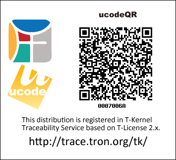

# TessronOS

TessronOSは、μT-Kernel 3.0をベースに、Raspberry Pi 5(Broadcom BCM2712、Arm Cortex-A76×4、AArch64)の上で動く、64bit、SMP、プロセス対応のTRON系OSです。

- 64bit化: AArch64(ARMv8.2-A)、48bitの仮想アドレス空間
- SMP: 4コアで1本のレディキューを共有し、スピンロックで排他する
- プロセス: T2EX相当のメモリ保護とプログラムのロード、固有のアドレス空間を持つプロセス
- 実身/仮身、xmlTAD: ファイル、デバイス、プロセス、ウインドウを、UUIDで識別する実身として同じ操作で扱う。実身を格納するファイルシステムTSFSは、TADjs Desktop形式のファイル群と相互に変換できる
- デスクトップ: BTRONの操作に合わせたデスクトップ、文章と図形の編集、かな漢字変換、小物

仕様書は[docs/tessronos.md](docs/tessronos.md)にあります。

ビルド、Raspberry Pi 5への書き込み、WindowsのQEMUでの試し方は[docs/build-and-run.md](docs/build-and-run.md)にまとています。

## 参考

- μT-Kernel 3.0: <https://github.com/tron-forum/mtkernel_3> / BSP2: <https://github.com/tron-forum/mtk3_bsp2>
- T-Kernel 2.0 Extension: <https://github.com/tron-forum/t2ex>
- SMP T-Kernel仕様書: <https://www.tron.org/ja/wp-content/uploads/sites/2/2015/03/TEF021-S002-01.00.01_ja.pdf>

## ライセンス

Copyright (C) 2026 satromi。μT-Kernel 3.0に由来する部分の著作権は、各ファイルのヘッダに記載のとおり坂村健氏にあります。

μT-Kernel 3.0に由来する部分はT-License 2.2に従う。新規部分(ソースコード、ビルド用ファイル、ツール、文書、リソース)もT-License 2.2に統一します。T2EXとはシステムコールの名称と引数を合わせているが、T2EXのソースコードは含んでいません。

同梱している第三者のソフトウェアとリソースのライセンスは[THIRD_PARTY_NOTICES.md](THIRD_PARTY_NOTICES.md)にまとめています。

TessronOSは、μT-Kernel 3.0のソースコードを利用し改変した派生物として、トロンフォーラムのトレーサビリティサービスに登録しています。

- ディストリビューション ucode: 0007006A

https://trace.tron.org/tk/00001C0000000000000000000007006A?lang=ja
